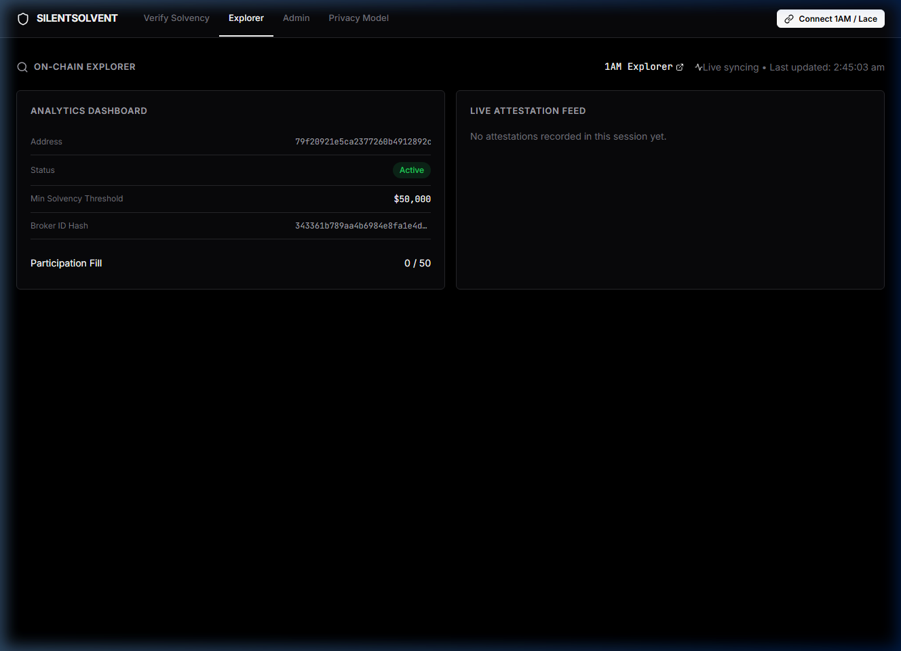
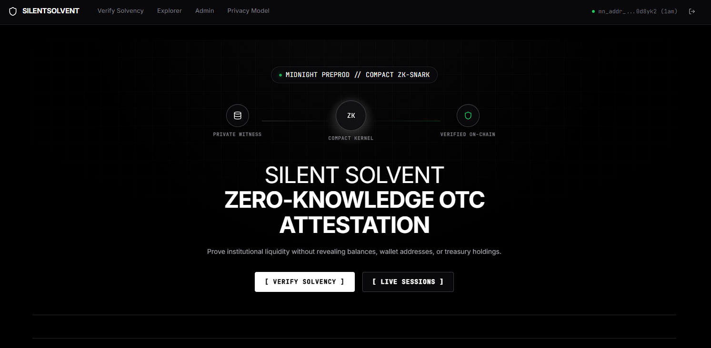
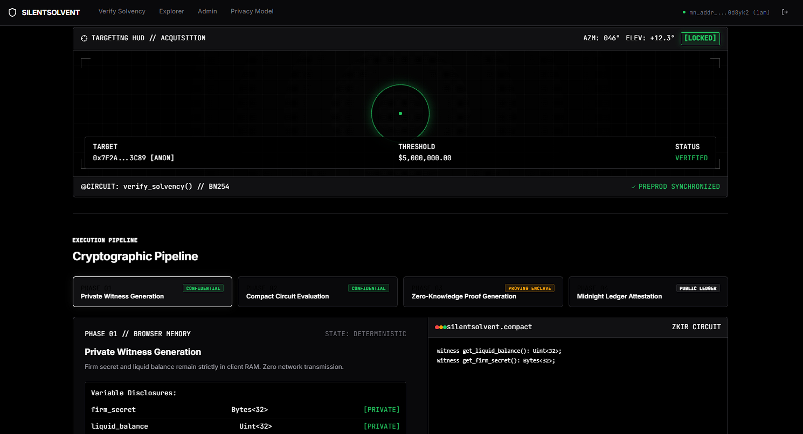
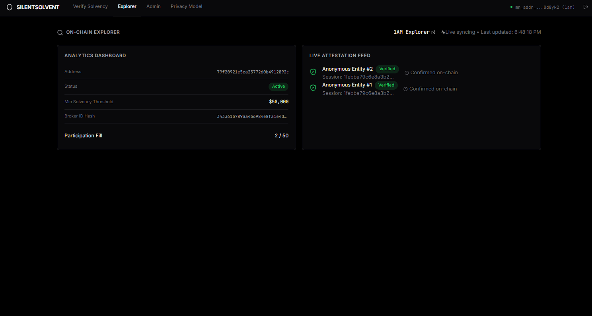
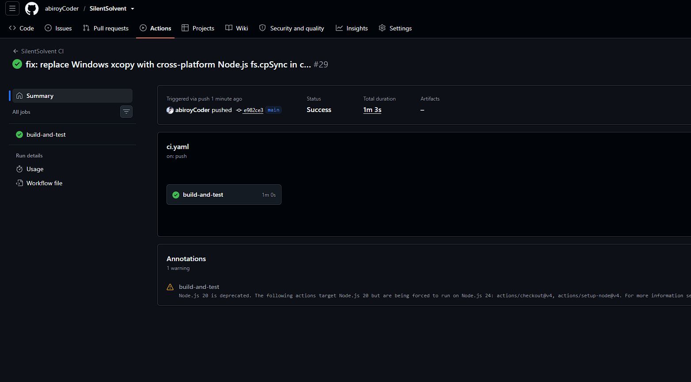

<div align="center">

# SilentSolvent

### Prove your capital. Keep your wallets silent.

A zero-knowledge pre-trade liquidity attestation dApp on [Midnight Network](https://midnight.network) designed for institutional OTC block trades.

[](https://silentsolvent.netlify.app/)
[](https://explorer.1am.xyz/contract/79f20921e5ca2377260b4912892cb690f20afa14ccc86667e697724d6eb13268?network=preprod)
[](https://x.com/silentsolvent)
[](https://github.com/abiroyCoder/SilentSolvent/actions/workflows/ci.yaml)
[](LICENSE)

</div>

> [!IMPORTANT]
> ### 🌐 Level 2 & Level 3 Mandatory Deliverables & Verification Links
> * **⚡ Contract Address (Preprod)**: **`79f20921e5ca2377260b4912892cb690f20afa14ccc86667e697724d6eb13268`** ([1AM Explorer](https://explorer.1am.xyz/contract/79f20921e5ca2377260b4912892cb690f20afa14ccc86667e697724d6eb13268?network=preprod))
> * **⚡ Hex Representation**: `0x79f20921e5ca2377260b4912892cb690f20afa14ccc86667e697724d6eb13268` (Network: **Midnight Preprod**)
> * **🚀 Live Demo dApp URL (Netlify)**: **[https://silentsolvent.netlify.app](https://silentsolvent.netlify.app/)**
> * **📄 Dedicated Architecture Proposal**: **[`PROPOSAL.md`](PROPOSAL.md)** (Covers Users, Kachina Data Model, Why Midnight, Mainnet Feasibility by Level 6)
> * **🔍 1AM Block Explorer**: **[View Contract on 1AM Preprod Explorer](https://explorer.1am.xyz/contract/79f20921e5ca2377260b4912892cb690f20afa14ccc86667e697724d6eb13268?network=preprod)**
> * **🔗 Deployment Transaction**: [`efe5cfb2c7ae11a4fb63917eba5c1e39134956229e79d4b39f70ff6d9d108800`](https://explorer.1am.xyz/tx/efe5cfb2c7ae11a4fb63917eba5c1e39134956229e79d4b39f70ff6d9d108800?network=preprod)
> * **📜 On-Chain Deployment Evidence**: **[`contracts/deployment-evidence.json`](contracts/deployment-evidence.json)**
> * **🔄 Automated Deployment / CD Workflow**: **[`.github/workflows/deploy.yaml`](.github/workflows/deploy.yaml)**

---

## Table of Contents
1. [Contract Address (Preprod) & Live Demo URL](#contract-address-preprod)
2. [Project Proposal & Scope Feasibility (Level 3)](#project-proposal--scope-feasibility)
3. [Overview and Problem Statement](#overview-and-problem-statement)
4. [What is SilentSolvent?](#what-is-silentsolvent)
5. [Submission Verification Checklist](#submission-verification-checklist)
6. [Interface Screenshots](#interface-screenshots)
7. [How it Works: Public State vs Private Witness](#how-it-works-public-state-vs-private-witness)
8. [Hackathon Execution (Levels 1-4)](#hackathon-execution-levels-1-4)
9. [Privacy Model: What an Observer Learns](#privacy-model-what-an-observer-learns)
10. [Architecture](#architecture)
11. [Getting Started (Local Development)](#getting-started-local-development)
12. [Demonstration Videos & Live Links](#demonstration-videos--live-links)

---

## Contract Address (Preprod)

SilentSolvent is compiled with Compact and deployed live on the **Midnight Preprod Testnet**:

* **Contract Address (Preprod)**: `79f20921e5ca2377260b4912892cb690f20afa14ccc86667e697724d6eb13268`
* **Contract Address (Preprod Hex)**: `0x79f20921e5ca2377260b4912892cb690f20afa14ccc86667e697724d6eb13268`
* **Network**: **Midnight Preprod**
* **Deployment Transaction**: [`efe5cfb2c7ae11a4fb63917eba5c1e39134956229e79d4b39f70ff6d9d108800`](https://explorer.1am.xyz/tx/efe5cfb2c7ae11a4fb63917eba5c1e39134956229e79d4b39f70ff6d9d108800?network=preprod)
* **1AM Block Explorer URL**: [https://explorer.1am.xyz/contract/79f20921e5ca2377260b4912892cb690f20afa14ccc86667e697724d6eb13268?network=preprod](https://explorer.1am.xyz/contract/79f20921e5ca2377260b4912892cb690f20afa14ccc86667e697724d6eb13268?network=preprod)
* **Live Demo dApp (Level 2 Deliverable)**: [https://silentsolvent.netlify.app](https://silentsolvent.netlify.app/)
* **On-Chain State Status**: `Active` (Synchronized via Preprod Indexer GraphQL API v4)

#### Preprod Contract Explorer & Live Sync Telemetry
Below is the live on-chain explorer telemetry confirming contract registration, active status, threshold parameter, and indexing synchronization on Midnight Preprod:



---

## Project Proposal & Scope Feasibility

A dedicated architectural document is available in [`PROPOSAL.md`](PROPOSAL.md) addressing all four Level 3 hackathon criteria:
1. **Product Statement, Problem & Target Users**: Eliminating custody address exposure and front-running in $1M–$50M+ OTC block trades.
2. **Public Ledger vs. Private Witness Data Model**: Formal specification of public state (`min_solvency_threshold`, `session_deadline`, `nullifiers`) versus private witnesses (`get_liquid_balance`, `get_firm_secret`).
3. **Why Midnight Specifically?**: Analysis of why transparent blockchains (Ethereum, Solana, EVM L2s) fundamentally fail at confidential solvency checks, and how Midnight's Kachina dual-state architecture and Compact DSL solve this.
4. **Scope Feasibility for Mainnet by Level 6**: Comprehensive milestone roadmap spanning Levels 1–6 (Multi-session desk portal, Schnorr proof-of-reserve oracles, ZSwap multi-asset aggregation, security audits, and Mainnet launch with regulatory viewing keys).

---

## Overview and Problem Statement

In institutional crypto, off-exchange block trades ($1M - $50M+) require proof of funds before any trade can be negotiated. Today, trading funds must either share their custody wallet addresses (exposing themselves to front-running algorithms and analytics by platforms like Arkham/Nansen) or share auditor statements (which are slow to verify and easily forged).

This creates a massive data leakage problem for institutional OTC trading. Institutions shouldn't have to broadcast their entire balance sheet just to prove they meet a $5M minimum threshold for a single trade.

---

## What is SilentSolvent?

**SilentSolvent** is a zero-knowledge liquidity attestation protocol built on the Midnight Network.

It allows an institutional trading fund to prove they have sufficient capital to execute a block trade without ever revealing their wallet addresses, total capital, or token composition to the OTC desk (or the public). 

The broker deploys a session with a minimum threshold on the Midnight Network. The fund connects their wallet and generates a Zero-Knowledge proof locally in their browser. The blockchain verifies the math and records the attestation. Zero data leakage.

---

## Submission Verification Checklist

| Requirement | Verification Method | Artifact / Resource Link |
| :--- | :--- | :--- |
| **Contract Address (Preprod)** | On-Chain Verification | **[`79f20921e5ca2377260b4912892cb690f20afa14ccc86667e697724d6eb13268`](https://explorer.1am.xyz/contract/79f20921e5ca2377260b4912892cb690f20afa14ccc86667e697724d6eb13268?network=preprod)** ([1AM Explorer](https://explorer.1am.xyz/contract/79f20921e5ca2377260b4912892cb690f20afa14ccc86667e697724d6eb13268?network=preprod)) |
| **Deployment Evidence** | Verified On-Chain Telemetry | [`contracts/deployment-evidence.json`](contracts/deployment-evidence.json) |
| **Live Demo dApp (Level 2 Deliverable)** | Web Browser Access | **[https://silentsolvent.netlify.app](https://silentsolvent.netlify.app/)** |
| **Project Proposal (Level 3 Deliverable)** | Architecture & Scope Review | **[`PROPOSAL.md`](PROPOSAL.md)** (Answers all 4 questions) |
| **Compact Smart Contract** | Review logic and circuits | [`contracts/silentsolvent.compact`](contracts/silentsolvent.compact) |
| **Circuits and Keys** | Inspect generated artifacts | [`contracts/managed/silentsolvent/`](contracts/managed/silentsolvent/) |
| **Automated Test Suite** | Execute `npm run test` | Passing 11-test suite (6 circuits + 5-stage Frontend E2E) |
| **CI/CD Pipeline** | GitHub Actions | [CI Workflow](.github/workflows/ci.yaml) & [CD Deploy Workflow](.github/workflows/deploy.yaml) |
| **Wallet Integration** | Launch UI | Official DApp Connector API (`@midnight-ntwrk/dapp-connector-api`) |
| **Authenticated Balance Source** | Review UI & witness source | Midnight Native Indexer Proof + Institutional PoR Oracle |
| **Persistent Firm Credential** | Review identity system | Persistent cryptographic commitment + One-attestation Sybil protection |
| **Privacy Model Documentation** | Review specification | [Privacy Model Section](#privacy-model-what-an-observer-learns) |
| **Video Demonstration** | Watch walkthrough | [Google Drive Demo Video](https://drive.google.com/file/d/15s4wkaOlXco3ur7x6DqAvf2jk8FsmTNR/view?usp=sharing) |
| **Public Announcement** | Verified post on X | [Launch Post on X](https://x.com/silentsolvent) |

---

## Interface Screenshots

#### 1. Zero-Knowledge Proof Dashboard
Funds can review active OTC sessions and securely generate a local zero-knowledge proof of their liquidity.



---

#### 2. Verify Solvency 
Real-time proof verification interface featuring scoped nullifiers and balance checks without revealing the exact balance.



---

#### 3. Admin Controls
Broker dashboard to create new liquidity sessions, set threshold requirements, and monitor attestations.



---

#### 4. Automated CI/CD Pipeline
Fully automated GitHub Actions pipeline validating the Compact contracts, tests, and building the frontend workspace.



---

## How it Works: Public State vs Private Witness

SilentSolvent enforces a strict architectural boundary between on-chain ledger state and client-side private witnesses:

| Data Element | Public Ledger State | Private Client Witness | Cryptographic Privacy Guarantee |
| :--- | :--- | :--- | :--- |
| **Fund Identity** | None | Private Firm Secret | The firm's identity and wallet addresses are NEVER passed as circuit arguments. |
| **Threshold Verification** | Session Threshold | Liquid Balance (`liquid_balance`) | Evaluates `liquid_balance >= threshold` strictly inside the circuit. Actual balance is never leaked. |
| **Anti-Sybil / Double Voting** | `session_nullifier` | Private Firm Secret | A session-scoped nullifier is hashed with the current `session_id`. Double-attestations fail consensus. |
| **Session Control** | `session_deadline`, `threshold` | Admin Secret Key | Config circuits are guarded by an admin public key derived via a domain-separated hash. |

Zero-knowledge proofs are generated locally by the fund. An observer or broker **cannot identify which fund produced the proof**, nor link verification back to their actual custody wallets.

---

## Hackathon Execution (Levels 1-4)

### Level 1: New Moon - Setup and First Contract
* **Toolchain Installation**: Configured development environment with `compactc`, Midnight TypeScript SDKs (`@midnight-ntwrk/midnight-js-*`), Vite, Docker, and Node.js 22.
* **Smart Contract Development**: Implemented [`silentsolvent.compact`](contracts/silentsolvent.compact) with public state management (sessions, attestations) and private witnesses.
* **Live Preprod Deployment**: Deployed the verified SilentSolvent Compact contract to **Midnight Preprod** at contract address [`79f20921e5ca2377260b4912892cb690f20afa14ccc86667e697724d6eb13268`](https://explorer.1am.xyz/contract/79f20921e5ca2377260b4912892cb690f20afa14ccc86667e697724d6eb13268?network=preprod) via transaction [`efe5cfb2c7ae11a4fb63917eba5c1e39134956229e79d4b39f70ff6d9d108800`](https://explorer.1am.xyz/tx/efe5cfb2c7ae11a4fb63917eba5c1e39134956229e79d4b39f70ff6d9d108800?network=preprod).

### Level 2: Waxing Crescent - Frontend Integration
* **Live Demo dApp URL (Mandatory Deliverable)**: Production frontend application hosted and accessible live at **[https://silentsolvent.netlify.app](https://silentsolvent.netlify.app/)**.
* **Deployed Preprod Contract Address (Mandatory Deliverable)**: Connected and live-synchronized with verified Midnight Preprod contract **[`79f20921e5ca2377260b4912892cb690f20afa14ccc86667e697724d6eb13268`](https://explorer.1am.xyz/contract/79f20921e5ca2377260b4912892cb690f20afa14ccc86667e697724d6eb13268?network=preprod)**.
* **Official DApp Connector API Integration**: Integrated browser wallet connection explicitly via `@midnight-ntwrk/dapp-connector-api` supporting 1AM, Lace, and standard Midnight wallets with network detection and status polling.
* **Client-Side Proving**: The React frontend interfaces with the deployed contract to coordinate local ZK proof generation via the wallet's proving provider and submit transactions.
* **Observable Privacy Behavior**: When evaluating threshold predicates, exact capital amounts remain entirely within client memory. Only the cryptographic proof reaches the ledger.

### Level 3: First Quarter - Production-Grade dApp & Pipeline Hardening
* **Selected Problem Statement**: Prove liquidity for OTC block trades without exposing custody wallets or total capital.
* **Formal Project Proposal ([`PROPOSAL.md`](PROPOSAL.md))**: Delivered comprehensive proposal addressing all 4 hackathon questions (Problem & Users, Public vs Private Data Model, Why Midnight Specifically, and Mainnet Scope Feasibility by Level 6).
* **Authenticated Balance Source**: Replaced manual text input with a verified balance provider:
  - **Midnight-Native On-Chain Balance**: Direct indexer-authenticated UTXO balance query for the connected wallet.
  - **Institutional Proof-of-Reserve (PoR) Oracle**: Cryptographically signed custodian attestations (Fireblocks Prime, Coinbase Prime, Copper ClearLoop) with digital signature validation and expiration checks.
* **Production Integrity & Strict Submission**: Removed fake transaction fallback. Transactions strictly require real wallet connection, proving, and on-chain submission.
* **Persistent Cryptographic Firm Credentials**: Institutional identity seeds are stored in persistent client storage with public commitment derivation (`persistentHash`) and identity management.
* **Genuine One-Attestation-Per-Credential Semantics**: Frontend evaluates session nullifiers against on-chain ledger state (`nullifiers` and `attestation_log`), preventing duplicate attestations while guarding against Sybil attacks.
* **Persistent Private State & Admin Key Storage**: Private state provider and admin credentials persist across page reloads via local storage synchronization, featuring on-chain admin authorization verification.
* **Real Indexed Explorer**: Explorer displays actual on-chain nullifier records and real indexer transaction telemetry instead of synthetic array iterations.
* **Full Automated Test Suite (11 Tests)**: 6 smart contract circuit tests + 5-stage Frontend E2E pipeline (`wallet → witness → proof → transaction → Preprod confirmation → indexer state change`).
* **Deployment Evidence & CD Workflow**: Documented full on-chain deployment evidence ([`contracts/deployment-evidence.json`](contracts/deployment-evidence.json)) and automated deployment workflow ([`.github/workflows/deploy.yaml`](.github/workflows/deploy.yaml)).

### Level 4: Waxing Gibbous - MVP and Contract Logic
* **Production Contract Circuits**:
  - **Session Management**: Config circuits (`update_session`, `pause_session`) with admin authentication.
  - **Time-based expiration**: Attestations fail after the `session_deadline` using `blockTimeLt()`.
  - **Solvency Verification**: Multi-predicate gate validating liquidity threshold and anti-double-attestation in a single zero-knowledge proof.
* **Public Social Presence**: Official announcement and demonstration thread published on X: [Launch Post on X](https://x.com/silentsolvent).

---

## Privacy Model: What an Observer Learns

Midnight uses the Kachina model for zero-knowledge smart contracts, strictly isolating public ledger state updates from private witness inputs.

### What an Observer CAN Learn (Publicly Verifiable on Chain)
1. That a solvency attestation occurred.
2. The total attestation count for a given session.
3. The session's threshold requirement and deadline.
4. The nullifier hash (preventing double-attestations).

### What an Observer CANNOT Learn (Cryptographically Concealed)
1. The firm's actual balance (whether they have $5.1M or $500M).
2. The firm's wallet addresses or custodian identity.
3. Which specific firm attested.

---

## Architecture

The SilentSolvent repository is organized as a monorepo:

```text
silentsolvent/
├── contracts/       Compact smart contract (silentsolvent.compact) and compiled ZK artifacts
├── frontend/        Production frontend dApp and admin controls (Vite + React)
├── scripts/         Cross-platform build, synchronization, and testing utilities
└── assets/          Interface screenshots and demonstration media
```

---

## Getting Started (Local Development)

**Prerequisites:** Node.js 22+, Docker, Midnight-compatible wallet (1AM), and npm.

1. **Start the Local Midnight Devnet**
   ```bash
   npm run env:up
   ```

2. **Wait for Network & Compile Contracts**
   ```bash
   npx ts-node --esm scripts/wait-for-dust.ts
   npm run compile
   ```

3. **Run Automated Test Suite**
   ```bash
   npm run test:local
   ```

4. **Start the Frontend Application**
   ```bash
   npm run copy:managed
   cd frontend
   npm install
   npm run dev
   ```
   Open `http://localhost:5173` in your browser.

---

## Demonstration Videos & Live Links

* **🚀 [Live Web dApp (Netlify)](https://silentsolvent.netlify.app/)**
* **⚡ [Deployed Contract on 1AM Preprod Explorer](https://explorer.1am.xyz/contract/79f20921e5ca2377260b4912892cb690f20afa14ccc86667e697724d6eb13268?network=preprod)**: `79f20921e5ca2377260b4912892cb690f20afa14ccc86667e697724d6eb13268`
* **📺 [Watch SilentSolvent Walkthrough on Google Drive](https://drive.google.com/file/d/15s4wkaOlXco3ur7x6DqAvf2jk8FsmTNR/view?usp=sharing)**
* **🐦 [Official Announcement on X](https://x.com/silentsolvent)**

---

## License

MIT License. See [LICENSE](LICENSE) for details.
